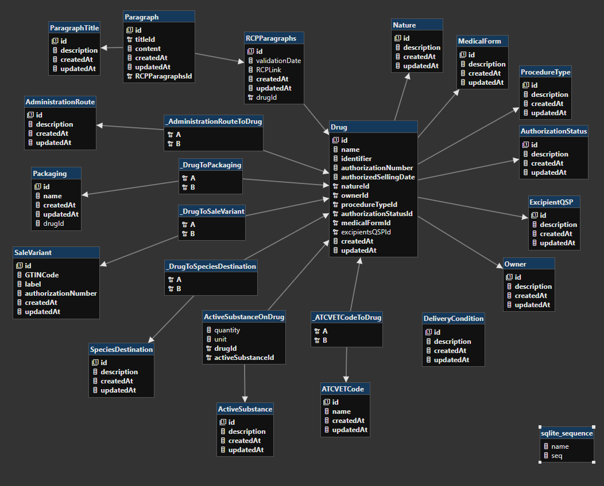

# API de lecture des médicaments vétérinaires de France

Cette API à pour but de rendre accessible en lecture l'intégralité des médicaments vétérinaires autorisés en France.

Elle s'appuie sur un couple de deux fichiers XML fournis par la plateforme [https://data.gouv.fr/].

La valeur des données n’est pas transformée. Seules les clés le sont pour en exposer la version anglophone.

La correspondance de ces clés anglophones est décrite dans la spécification Open API 3.0 fourni avec l'API.

La documentation est disponible ici : [https://vets-doxwjojdmq-od.a.run.app]

> **Warning**
> Cette API n'a pas d'authentification est autorise les CORS sur toutes les origines.
> Si toutefois elle commence à en être abusée, je me réserve le droit d'ajouter une authentification, voire même de couper l'accès au service.

## Modèle de données

### Sources

- [Notice d'utilisation des données](https://www.data.gouv.fr/fr/datasets/r/a226ace0-a9ed-466e-9316-723eef86fa34)
- [Base de données des médicaments vétérinaires autorisés en France (XML)](https://www.data.gouv.fr/fr/datasets/r/d1d8c576-3aa4-4c29-98ed-de6d374cc884)
- [Données de Référence (XML)](https://www.data.gouv.fr/fr/datasets/r/67f242fc-0991-4c60-a1bc-24b75de155aa)

### Modèle de base de données



## Stack technique

Le fonctionnement est découpé en 3 étapes :

- Un script permettant d'ingérer les fichiers au format XML pour les transformer en un JSON pour faciliter l'ingestion des données dans une base de données
- Un script permettant de faire l'ingestion des données JSON dans une base de données
- Une API qui expose les données

### Déploiement

L'API est d'abord mis en container via Docker puis publié sur une registry privée sur la plateforme Google Cloud : Google Cloud Artifacts.

Cette image Docker est ensuite déployée dans un environnement serverless de Google Cloud : Google Cloud Run.

La base de données au format SQLite est directement commité et embarqué dans l'image Docker ce qui permet de ne pas avoir à maintenir de base de données à côté. Tout est "self-contained" dans une image Docker.

Dans la mesure où la base de données et l'API ne sont qu'en lecture seule, cela ne pose pas de problème pour l'objectif qu'à cette API.

### Self-host l'API

Voici dans les grandes lignes les instructions pour faire tourner l'API vous-même :

#### Setup

```bash
$ git clone ...
$ pnpm install
$ pnpm prisma db push
$ pnpm prisma generate
$ pnpm ingest
$ pnpm seed
```

#### Run localement

```bash
$ pnpm dev
```

#### Run en production

```bash
$ pnpm start
```

#### Run avec Docker

```bash
$ docker build -t vets .
$ docker run -p 8080:8080 vets
```

### Outils

- [typescript](https://www.typescriptlang.org/) - Le langage utilisé
- [fastify](https://www.fastify.io/) - Le serveur derrière l'API
- [https://www.npmjs.com/package/tsx](https://www.npmjs.com/package/tsx) - L'outil permettant de faire tourner le serveur (en dev comme en prod)
- [prisma](prisma.io) - Toute la partie interface base de données
- [sqlite](https://www.sqlite.org/index.html) - Le moteur de base de données
- [prettier](https://prettier.io/) - Outil de formatage de code
- [docker](https://www.docker.com/) - Outil de container pour le déploiement
- [fast-xml-parser](https://www.npmjs.com/package/fast-xml-parser) - Librairie pour transformer le XML en JSON
- [pnpm](https://pnpm.io) - Le package manager
- [redoc](https://github.com/Redocly/redoc) et [Open API](https://oai.github.io/Documentation/) - Génération de la documentation
